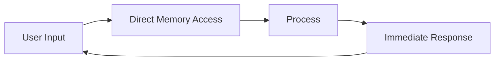

# Technical Architecture: On-Device vs Server-Based AI Agents

## Architectural Overview

### Server-Based Architecture

```
┌─────────────┐       Network       ┌──────────────────┐
│   Client    │◄─────────────────────►│  Server Farm     │
│  (Thin)     │       Latency        │  - Load Balancer │
│             │       Bandwidth      │  - API Gateway   │
│             │       Reliability    │  - Model Server  │
└─────────────┘                      │  - Database      │
                                     └──────────────────┘
```

**Characteristics:**
- Centralized intelligence
- Network-dependent operation
- Shared computational resources
- Stateless client interactions

### On-Device Architecture

```
┌──────────────────────────────┐
│      Device (Smart)          │
│  ┌────────────────────────┐  │
│  │   AI Runtime Engine    │  │        Optional
│  │  - Model Inference     │  │◄─────────────────►[Cloud]
│  │  - Local Storage       │  │      (Updates/Sync)
│  │  - Context Management  │  │
│  └────────────────────────┘  │
└──────────────────────────────┘
```

**Characteristics:**
- Distributed intelligence
- Autonomous operation
- Dedicated computational resources
- Stateful, continuous learning

## Component Analysis

### Model Deployment

#### Server-Based
```python
# Server deployment pattern
class ServerModel:
    def __init__(self):
        self.model = load_large_model()  # 100GB+ models
        self.cache = distributed_cache()
        self.gpu_cluster = allocate_gpus()
    
    def serve_request(self, request):
        # Queue management
        # Load balancing
        # Authentication
        # Rate limiting
        return self.model.predict(request)
```

**Challenges:**
- Version management across users
- Resource allocation
- Scaling bottlenecks
- Cold start problems

#### On-Device
```python
# On-device deployment pattern
class OnDeviceModel:
    def __init__(self):
        self.model = load_optimized_model()  # 1-10GB models
        self.context = local_context_store()
        self.hardware = device_accelerator()  # NPU/GPU
    
    def process_locally(self, input):
        # Direct processing
        # No network overhead
        # Immediate response
        return self.model.predict(input, context=self.context)
```

**Advantages:**
- Personalized models
- Zero network latency
- Predictable performance
- No scaling issues

### Data Flow Architecture

#### Server-Based Data Flow


**Overhead per request:**
- Serialization: ~10-50ms
- Network round-trip: ~20-500ms
- Queue wait time: ~0-1000ms
- Total overhead: ~30-1550ms

#### On-Device Data Flow


**Overhead per request:**
- Memory access: ~0.1ms
- Total overhead: ~0.1ms
- **1000x improvement** in latency

### State Management

#### Server-Based State
```yaml
State Management:
  Storage: External database/cache
  Consistency: Eventually consistent
  Access Pattern: Request-response
  Context Window: Limited by API
  Personalization: User ID based
  Recovery: From centralized backup
```

#### On-Device State
```yaml
State Management:
  Storage: Local persistent storage
  Consistency: Immediately consistent
  Access Pattern: Continuous
  Context Window: Unlimited locally
  Personalization: Deep, behavioral
  Recovery: Local snapshots
```

## Hardware Utilization

### Server Infrastructure
```
┌─────────────────────────────────────┐
│         Data Center                 │
├─────────────────────────────────────┤
│ • High-power GPUs (A100, H100)     │
│ • 400W+ per GPU                    │
│ • Cooling infrastructure            │
│ • Redundant power systems           │
│ • 24/7 operation costs              │
│ • Real estate expenses              │
└─────────────────────────────────────┘
```

**Cost Structure:**
- CapEx: $100K-1M per server rack
- OpEx: $10K-50K monthly per rack
- Utilization: 30-70% typical
- Energy: 10-50 kWh per user per month

### On-Device Hardware
```
┌─────────────────────────────────────┐
│      Consumer Device                │
├─────────────────────────────────────┤
│ • Neural Processing Unit (NPU)      │
│ • 5-15W power consumption           │
│ • Passive/minimal cooling           │
│ • User-powered                     │
│ • Marginal operation cost           │
│ • No additional real estate         │
└─────────────────────────────────────┘
```

**Cost Structure:**
- CapEx: $0 (user-owned)
- OpEx: $0.01-0.10 monthly per device
- Utilization: 100% available
- Energy: 0.1-1 kWh per month

## Model Optimization Techniques

### Server-Side Optimizations
- **Model Serving Frameworks**: TensorFlow Serving, TorchServe
- **Batching**: Group requests for efficiency
- **Caching**: Store frequent responses
- **Model Versioning**: A/B testing, gradual rollout

### On-Device Optimizations
- **Quantization**: INT8/INT4 precision
- **Pruning**: Remove unnecessary weights
- **Knowledge Distillation**: Smaller student models
- **Hardware Acceleration**: NPU/TPU specific optimizations
- **Edge-specific Frameworks**: TensorFlow Lite, Core ML, ONNX Runtime

### Comparative Performance

| Metric | Server-Based | On-Device |
|--------|--------------|-----------|
| Model Size | 10-1000GB | 0.1-10GB |
| Latency | 50-1000ms | 1-50ms |
| Throughput | 1000s req/s (shared) | 10-100 req/s (dedicated) |
| Memory | 100GB+ RAM | 4-16GB RAM |
| Precision | FP32/FP16 | INT8/INT4 |
| Accuracy | 95-99% | 90-95% |

## Network Architecture

### Server-Based Network Requirements
```
Requirements:
├── Bandwidth: 1-10 Mbps per active user
├── Latency: <500ms for acceptable UX
├── Reliability: 99.9% uptime needed
├── Security: End-to-end encryption
└── Protocols: HTTPS, WebSocket, gRPC
```

### On-Device Network Usage
```
Requirements:
├── Bandwidth: 0 Kbps (offline operation)
├── Latency: 0ms (local processing)
├── Reliability: 100% (no dependency)
├── Security: No transmission needed
└── Protocols: Optional sync only
```

## Software Stack Comparison

### Server-Based Stack
```
Application Layer
    └── API Gateway (Kong, Envoy)
        └── Service Mesh (Istio)
            └── Model Server (TorchServe)
                └── Container (Docker/K8s)
                    └── Infrastructure (AWS/GCP)
```

### On-Device Stack
```
Application Layer
    └── AI Framework (TFLite, CoreML)
        └── Hardware Abstraction (NNAPI)
            └── Device OS (iOS/Android/Windows)
                └── Hardware (CPU/GPU/NPU)
```

## Scalability Patterns

### Server Scaling Challenges
1. **Vertical Scaling**: Hardware limits
2. **Horizontal Scaling**: Coordination overhead
3. **Geographic Distribution**: Data sovereignty
4. **Load Balancing**: Complex routing
5. **Cost Scaling**: Linear or worse

### On-Device Scaling Advantages
1. **Infinite Horizontal Scale**: Each device scales itself
2. **Zero Coordination**: No inter-device communication
3. **Natural Geographic Distribution**: Users are distributed
4. **No Load Balancing**: Each device serves one user
5. **Cost Scaling**: None (user bears cost)

## Development and Deployment

### Server-Based CI/CD
```yaml
Pipeline:
  - Build: Compile and package
  - Test: Unit, integration, load testing
  - Deploy: Staged rollout
  - Monitor: Metrics, logging, alerting
  - Rollback: Version management
  
Complexity: High
Time to Deploy: Hours to days
Risk: System-wide impact
```

### On-Device Deployment
```yaml
Pipeline:
  - Build: Compile and optimize
  - Test: Device-specific testing
  - Deploy: App store / OTA update
  - Monitor: Telemetry (optional)
  - Rollback: User-controlled
  
Complexity: Medium
Time to Deploy: Days (app store)
Risk: Individual device impact
```

## Hybrid Architectures

### Best of Both Worlds
```
┌──────────────┐         ┌─────────────┐
│  On-Device   │◄────────►│   Cloud     │
│  - Fast path │  Sync   │ - Training  │
│  - Common    │         │ - Complex   │
│  - Private   │         │ - Shared    │
└──────────────┘         └─────────────┘
```

**Hybrid Strategies:**
1. **Federated Learning**: Train globally, run locally
2. **Progressive Enhancement**: Basic on-device, advanced in cloud
3. **Selective Offload**: Complex queries to cloud
4. **Model Updates**: Cloud training, edge deployment

## Technical Superiority Metrics

| Dimension | On-Device Advantage | Quantification |
|-----------|-------------------|----------------|
| Latency | 100-1000x faster | 1ms vs 100-1000ms |
| Availability | Always available | 100% vs 99.9% |
| Privacy | Complete | 0 data transmission |
| Bandwidth | Zero requirement | 0 vs 1-10 Mbps |
| Cost/User | 100-1000x lower | $0.01 vs $1-10/month |
| Scalability | Infinite | O(1) vs O(n) |
| Energy/Query | 10-100x efficient | 0.001 vs 0.01-0.1 kWh |

## Architectural Principles

### The Principle of Least Privilege
On-device agents naturally implement least privilege:
- Access only user's data
- No cross-user contamination
- Isolated execution environment

### The Principle of Defense in Depth
Multiple security layers:
1. Device security (biometrics, encryption)
2. App sandboxing
3. Model isolation
4. No network attack surface

### The Principle of Separation of Concerns
- **Device**: User interaction, real-time processing
- **Cloud**: Model training, knowledge updates
- **Edge**: Aggregation, federation

## Future-Proofing

### On-Device Trajectory
- **Hardware**: More powerful NPUs (100+ TOPS)
- **Software**: Better optimization techniques
- **Models**: Continued miniaturization
- **Result**: Desktop-class AI on mobile

### Server-Based Constraints
- **Energy**: Data center power limits
- **Latency**: Speed of light boundary
- **Cost**: Linear scaling with users
- **Privacy**: Increasing regulations

## Conclusion

The technical architecture comparison reveals fundamental advantages of on-device AI agents:

1. **Latency**: Physics favors local processing
2. **Scalability**: Distributed beats centralized
3. **Efficiency**: Dedicated resources outperform shared
4. **Reliability**: Fewer dependencies increase uptime
5. **Privacy**: Local processing eliminates transmission risk

These advantages compound, creating a superior architecture for the next generation of AI applications.