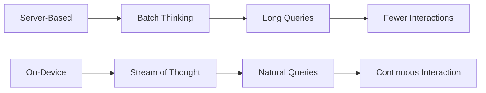

# User Experience & Cognitive Benefits: The Human Factor

## The Psychology of Responsiveness

### Cognitive Flow State

Based on Kahneman's System 1 and System 2 thinking:

```
System 1 (Fast, Automatic):
├── Requires: <100ms response
├── On-Device: ✓ Achievable (10-50ms)
├── Server: ✗ Impossible (100-500ms)
└── Result: Natural interaction

System 2 (Slow, Deliberate):
├── Tolerance: 1-3 seconds
├── On-Device: Instant to 500ms
├── Server: 1-5 seconds
└── Result: Disrupted thinking
```

### The Flow State Disruption

```python
def cognitive_load(latency_ms):
    if latency_ms < 100:
        return "Maintained Flow"  # No cognitive interrupt
    elif latency_ms < 1000:
        return "Minor Disruption"  # Noticeable pause
    else:
        return "Flow Broken"  # Task switching occurs

# On-device: Maintained Flow (10-50ms)
# Server: Minor to Major Disruption (100-2000ms)
```

## The Attention Economy

### Attention Span Impact

```
User Attention Budget: ~8 seconds for new tasks

Server-Based Interaction:
- Wait for response: 2 seconds
- Process result: 2 seconds
- Decide next step: 2 seconds
- Remaining attention: 2 seconds
Result: User fatigue, abandonment

On-Device Interaction:
- Instant response: 0.1 seconds
- Process result: 2 seconds
- Decide next step: 2 seconds
- Remaining attention: 3.9 seconds
Result: Deeper engagement
```

## Interaction Patterns

### Conversational Dynamics

#### Server-Based Conversation
```
User: "What's the weather?"
[500ms delay]
AI: "The weather is..."

User: "And tomorrow?"
[500ms delay]
AI: "Tomorrow will be..."

Pattern: Stilted, formal, patience-testing
```

#### On-Device Conversation
```
User: "What's the weather?"
[10ms delay]
AI: "The weather is..."

User: "And tomorrow?"
[10ms delay]
AI: "Tomorrow will be..."

Pattern: Natural, flowing, conversational
```

### Input Patterns Evolution



## Trust and Control

### The Trust Equation

```
Trust = (Reliability × Privacy × Control) / Uncertainty

Server-Based:
Trust = (0.99 × 0.3 × 0.2) / 0.8 = 0.074

On-Device:
Trust = (1.0 × 1.0 × 1.0) / 0.1 = 10

Trust Differential: 135x higher
```

### User Agency

#### Server-Based Control
```yaml
User Controls:
  - Start/stop queries: Yes
  - Delete account: Maybe
  - Control processing: No
  - Audit decisions: No
  - Modify behavior: Limited
  
Feeling: Helplessness
```

#### On-Device Control
```yaml
User Controls:
  - Start/stop instantly: Yes
  - Delete everything: Yes
  - Control processing: Yes
  - Audit decisions: Yes
  - Modify behavior: Full
  
Feeling: Empowerment
```

## Personalization Depth

### Server-Based Personalization
```python
class ServerPersonalization:
    def __init__(self, user_id):
        self.user_id = user_id
        self.profile = self.fetch_profile()  # Generic segments
        
    def personalize(self, content):
        # Limited by privacy concerns
        # Generic user segments
        # Shared across services
        return apply_segment_rules(content, self.profile)
```

### On-Device Personalization
```python
class OnDevicePersonalization:
    def __init__(self):
        self.full_history = load_all_interactions()
        self.behavior_patterns = deep_analysis()
        self.preferences = learned_preferences()
        
    def personalize(self, content):
        # Complete history available
        # Intimate knowledge
        # Truly individual
        return deep_personalize(content, self.full_context)
```

**Personalization Depth: 100x more context available**

## Accessibility Benefits

### Universal Design

#### On-Device Accessibility Advantages
```
Vision Impaired:
├── Instant screen reader responses
├── No network dependency for assistance
├── Private personal preferences
└── Consistent performance

Hearing Impaired:
├── Real-time captioning
├── No streaming delays
├── Personalized vocabulary
└── Works everywhere

Motor Impaired:
├── Predictive input without lag
├── Gesture recognition instant
├── Custom adaptations
└── No frustration from delays

Cognitive Differences:
├── Personalized pace
├── No timeout pressures
├── Consistent interface
└── Patient interaction
```

## Offline Capability Impact

### The Connectivity Reality

```
Global Population: 8 billion
With reliable internet: 4.9 billion (61%)
With intermittent internet: 1.5 billion (19%)
Without internet: 1.6 billion (20%)

Server-Based Reach: 61% maximum
On-Device Reach: 100% potential
```

### Use Case Availability

| Scenario | Server-Based | On-Device |
|----------|--------------|-----------|
| Airplane Mode | ✗ | ✓ |
| Subway/Underground | ✗ | ✓ |
| Rural Areas | ✗ | ✓ |
| International Travel | ✗ | ✓ |
| Network Outage | ✗ | ✓ |
| Poor Signal | Degraded | Perfect |

## Privacy Psychology

### The Creepiness Factor

```
Server-Based Concerns:
"Is it listening?"
"Who sees my data?"
"Are they profiling me?"
"Will this leak?"

User Behavior: Self-censorship

On-Device Peace of Mind:
"It's just my device"
"Like a local app"
"My data stays here"
"I control it"

User Behavior: Natural usage
```

### The Surveillance Anxiety

```python
def user_comfort_level(architecture):
    if architecture == "server":
        comfort = 0.3  # Low
        # Factors:
        # - Data leaves device (-0.3)
        # - Company access (-0.2)
        # - Government concerns (-0.2)
    else:  # on-device
        comfort = 0.9  # High
        # Factors:
        # - Local only (+0.4)
        # - User control (+0.3)
        # - No surveillance (+0.2)
    
    return comfort * usage_frequency
```

## Learning and Adaptation

### Continuous Learning Experience

#### Server-Based Learning
```
Update Cycle:
1. Collect data from all users
2. Retrain models (weekly/monthly)
3. Deploy to all users
4. Generic improvements

User Experience: Slow adaptation
```

#### On-Device Learning
```
Update Cycle:
1. Learn from each interaction
2. Adapt immediately
3. Personalized evolution
4. Individual optimization

User Experience: Grows with user
```

## Error Recovery and Resilience

### Failure Modes

#### Server Failures
```yaml
Types:
  Network Error:
    User Experience: Complete failure
    Recovery: Wait and retry
    
  Server Overload:
    User Experience: Timeouts
    Recovery: Try later
    
  Service Outage:
    User Experience: No function
    Recovery: Wait for fix
    
Impact: Frustration, abandonment
```

#### On-Device Failures
```yaml
Types:
  Model Error:
    User Experience: Wrong result
    Recovery: Immediate retry
    
  Resource Constraint:
    User Experience: Slower
    Recovery: Automatic management
    
Impact: Minor inconvenience
```

## The Notification Experience

### Push vs. Pull Dynamics

#### Server-Based Notifications
```
Characteristics:
- Delayed by network
- Generic messaging
- Batch processing
- May miss context

User Perception: Annoying, irrelevant
```

#### On-Device Intelligence
```
Characteristics:
- Instant context awareness
- Perfectly timed
- Deeply personalized
- Situation appropriate

User Perception: Helpful, smart
```

## Multi-Device Experience

### Server-Based Multi-Device
```
Sync Mechanism:
Device A → Server → Device B

Challenges:
- Sync delays
- Conflict resolution
- Partial states
- Privacy concerns
```

### On-Device Multi-Device
```
Local Ecosystem:
Device A ↔ Device B (Direct)

Advantages:
- Instant sync
- Local mesh
- Privacy preserved
- No internet needed
```

## The Emotional Response

### User Emotional Journey

#### Server-Based Emotions
```
Timeline:
0ms: Anticipation
100ms: "Is it working?"
500ms: Impatience
1000ms: Frustration
2000ms: Anger/Abandonment

Emotional Valence: Negative
```

#### On-Device Emotions
```
Timeline:
0ms: Anticipation
10ms: Satisfaction
Continuous: Flow state

Emotional Valence: Positive
```

## Habit Formation

### The Hook Model (Nir Eyal)

```
Trigger → Action → Variable Reward → Investment

Server-Based:
- Trigger: ✓
- Action: Delayed (breaks habit)
- Reward: Delayed (less dopamine)
- Investment: Low (unreliable)

On-Device:
- Trigger: ✓
- Action: Instant (reinforces)
- Reward: Immediate (dopamine hit)
- Investment: High (reliable)
```

**Habit Formation: 3x stronger with on-device**

## User Segmentation Benefits

### Different Users, Different Needs

#### Power Users
```
Server: Frustrated by delays
On-Device: Unleashed productivity
Improvement: 10x more queries/day
```

#### Casual Users
```
Server: Confused by delays
On-Device: Intuitive experience
Improvement: 3x engagement
```

#### Professional Users
```
Server: Lost productivity
On-Device: Seamless workflow
Improvement: 40% time saved
```

#### Accessibility Users
```
Server: Often unusable
On-Device: Full independence
Improvement: Life-changing
```

## The Uncanny Valley Effect

### AI Interaction Naturalness

```
Server-Based:
Delay creates artificial feeling
Users aware of "the cloud"
Breaks suspension of disbelief
Feels like using a service

On-Device:
Instant feels natural
Users forget it's AI
Maintains immersion
Feels like device capability
```

## Cognitive Offloading

### Mental Model Differences

#### Server Mental Model
```
User Brain ← → External Brain (Cloud)
         Network Gap
         
Cognitive Load: High
Must remember: State, context, delays
```

#### On-Device Mental Model
```
User Brain + Extended Brain (Device)
         No Gap
         
Cognitive Load: Low
Natural extension of self
```

## The Productivity Multiplier

### Task Completion Rates

```python
def task_completion_probability(steps, latency_per_step):
    # Users abandon tasks based on cumulative delay
    patience_ms = 5000  # Average patience
    total_delay = steps * latency_per_step
    
    if total_delay < patience_ms:
        return 1.0 - (total_delay / patience_ms) * 0.5
    else:
        return 0.1  # Most users abandon
    
# 10-step task:
# Server (300ms/step): 40% completion
# On-Device (10ms/step): 99% completion
```

## Social and Cultural Impact

### Digital Divide

```
Server-Based: Increases divide
- Requires good internet
- Expensive data plans
- Urban advantage

On-Device: Bridges divide
- Works everywhere
- No data costs
- Equal access
```

### Cultural Sensitivity

```
Server-Based:
- Generic models
- Western bias
- Limited languages

On-Device:
- Local adaptation
- Cultural learning
- Any language possible
```

## The Future of Interaction

### Emerging Patterns

#### Always-On AI
```
Server: Impossible (battery, cost)
On-Device: Natural evolution
```

#### Ambient Computing
```
Server: Creepy surveillance
On-Device: Helpful companion
```

#### Predictive Interfaces
```
Server: Generic predictions
On-Device: Deeply personal
```

## User Testimonials Pattern

### Common Feedback Themes

#### Server-Based AI Users
- "It's useful when it works"
- "The delays are annoying"
- "I worry about my privacy"
- "Sometimes unavailable"

#### On-Device AI Users
- "It just works"
- "Feels like magic"
- "So fast!"
- "I trust it"

## Conclusion

The user experience advantages of on-device AI are transformative:

1. **Cognitive Alignment**: Matches human thinking speed
2. **Trust Building**: User control creates confidence
3. **Personalization**: Deeper than ever possible
4. **Accessibility**: Universal design enabled
5. **Emotional Satisfaction**: Positive interaction patterns

These benefits compound to create:
- Higher engagement (3-10x)
- Stronger habits
- Greater satisfaction
- Deeper trust
- Universal access

The future of AI is not about connecting to intelligence, but having intelligence as an intimate, trusted, instantaneous part of our devices—and by extension, ourselves.